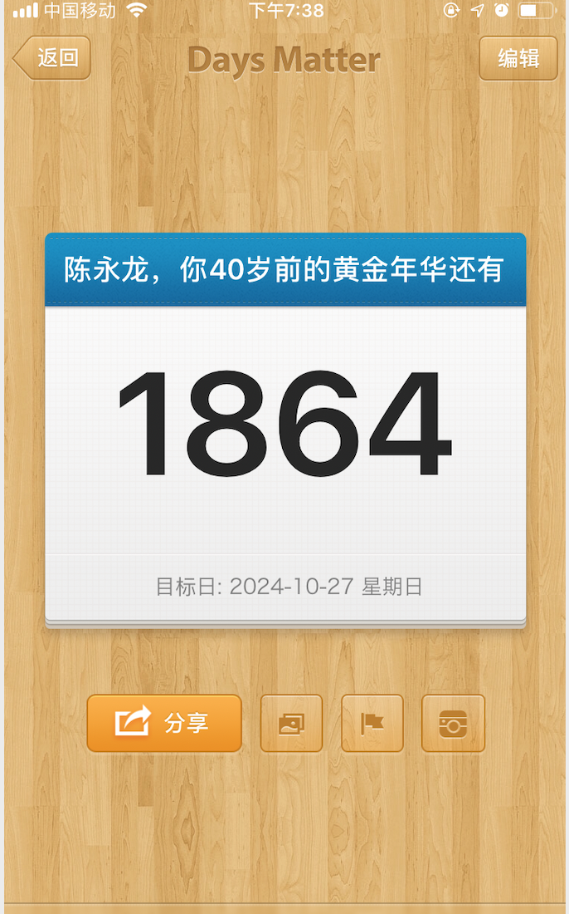

#### 再自律的人， 有梦想也需要被提醒！

我之前在一个课程里面提过这样一个故事， 关于秦始王的。

他说秦始王在统一六国前就有统一六国的宏大志向。 秦始王按道理是一个超级自律的人， 可是秦始王还是需要有人提醒他这个志向， 他命令他的侍卫在每天早上起床的准点都大叫一句：『秦王嬴政，你可记得统一六国的梦想吗？』；同时， 当秦王在犹豫不定的时候， 他的侍卫也会大叫：『秦王嬴政，你可记得统一六国的梦想吗？』，以此来决断事情！

的确，当我们有一个梦想或重要的时间节点，有一个好的方法提醒我们， 可以更好的让我们朝着梦想的方向走。**那有什么办法更好的提醒我们的梦想、重要的时间节点呢？** 想了几个，跟大家分享！

**第一个：如果你有你的『侍卫』**- 员工、爱人、导师、朋友……，并且 ta 不觉得烦，那应该是一个比较好的选择。

**第二个：梦想板**，把自己的梦想贴出来，每天一看，激励自己向着梦想走。

大家可以看看古典老师在新精英生涯 “做自己节” 暨第 8 届 “做自己论坛” 的视频
【定制 2019】——古典老师带你绘制 2019 梦想板
https://www.iqiyi.com/v_19rqr82hi4.html

**第三个：介绍一个 APP『倒数日』**，当然日历或清单也是可以，可是术业有专攻！日历一般用来记录时间确定并一定要做的事情；清单记录跟进自己场景不同而需要完成的事情（精力、场地、优先级等）。日历清单未来会介绍，今天介绍个简单的『倒数日』。

还记得吗？普林斯顿大学心理学家艾米丽·普罗宁通过实验证明，大脑错误的想象会让我们像对待陌生人一样对待未来的自己。**『倒数日』就是可以帮我们跟未来的自己拉进。每天早上，它会提醒我们离我们重要的日子还有多少天，从而让我们更加具体的看到了时间的流逝，从而减少拖延，完成想完成的事情。**(注意：倒数日里面要设置人生最重要的梦想或节点，如果设置多了，会对提醒麻木)

我自己就设置了这样一个，哈哈。

现在 APP 使用都比较简单，实在想看如何使用『倒数日』，可以查看:
https://jingyan.baidu.com/article/8ebacdf0510bed49f65cd51b.html

**再自律的人， 有梦想也需要被提醒！**
