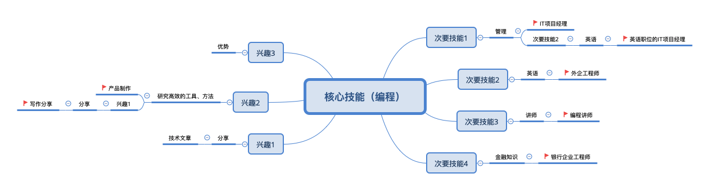

#### 多维度打造竞争力|找到自我的多维角色

李笑来老师关于『多维度打造竞争力』提到三个点！

- 第一，生活具有多个维度；
- 第二，在多个维度打造竞争力；
- 第三，至少在一个维度上足够突出。

诚然，**在单维度上与他人竞争，总是人比人比死人！ 而生活具有多维度，多维度上，每个人都有自己的优势**！在我们现实生活中，例子还是蛮多的。 有时我们程序员会调侃自己，说 35 岁后就找不到工作之类的， 往往是因为可能我们只是做单纯的某个领域的编程，而随着年资的增加，工资也高了，但相比更加年轻的小伙伴 “性价比” 就低了！ 而如果一个 35 岁的程序员懂点业务，懂点管理或沟通就可以成为项目经理或者产品经理！

可是有时候知道这个道理，却**很难去知道该从哪里找方向！那有没有办法更好的看到自己的多维角色呢？**

**结合脑图，有一个用法可以很好的找到自我的多维角色** !

具体： **以核心技能为脑图中心，次级是次要技能、兴趣！再结合出不同的角色！**

下面是脑图例子：

例如：

- 核心技能编程 + 次要技能管理， 那可以扩展一个角色是 IT 项目经理；
- 核心技能编程 + 次要技能管理 + 次要技能英语 , 那可以扩展一个角色英文职位的 IT 项目经理;
- 核心技能编程 + 兴趣技能分享，那可以扩展技术文章; 

再仔细的**分析一下可能的角色， 我们可以更好的找到自我的多维角色**。

- 有些角色是以一份时间换一份时间
- 有些角色是以一份时间换多份时间

我们可以根据自己的需求， 选择想发展的方向！
