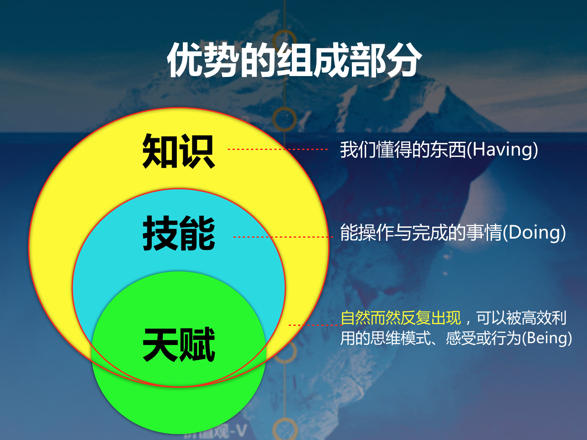

##### 每个人都拥有与众不同的天赋

> 与『天赋』结缘源自于两年前在橙子学院听刘佳老师的线上课《天赋与优势》，今年 6 月份也正式上了刘佳老师的优势线下课。刘佳老师：殷睐学堂创始人、清华大学管理学博士 , 优势教练。

电影《嗝嗝老师》里面有这样一段关于天赋的！

嗝嗝老师被指派的班级学生是全校最淘气的学生，也是贫民窟里的孩子。我相信，之前，孩子们也觉得自己这辈子也只能待在贫民窟中，就如小胖子说的：“我相当确定我就是个蠢才”。嗝嗝老师说：“你们**每个人都有各自擅长的领域**：搞赌博的，擅长数学；修汽车的，擅长物理；煮饭好的，擅长化学；**聪明的使用它们**！就如想要赌博的，你想要去赌，就要做合法的， 不是在路边摆个摊子赌博，而是去世界上最大的舞台——股市，学着在股市上下注。**谁知道呢， 你也许能成为投资银行家，但为此你必须做好准备。**

###### 基于优势的 2 个核心理念

从嗝嗝老师中就提到，关于天赋，每个人都有各自擅长的领域 , 我们需要聪明的使用它们，找到合适的地方。

这里也可以带出来**基于优势的 2 个核心理念**：
- 1、每个人都拥有与众不同的天赋 / 才干
- 2、每个人最大的成长空间在于其最强的优势领域

我想这个也是愿意使用天赋优势这套理论在生活的两个基础，如果本来就不认同的人后面也是不会去使用这套理论后面的知识。

###### 为什么需要知道我们的天赋、优势

我喜欢古典老师的一个比喻:
> - 今天你用地图搜索导航，会出现几条路线，有躲避拥堵的，有时间最短的，有不上高速的，
>- **优势则是告诉你，你是辆什么车？是越野车，还是跑车，决定你最后走盘山公路还是高速路，你烧什么油？是找个加油站，还是找到充电桩？**
>- 用自己擅长的方式做最爱的事一一在热爱的领域努力的玩。

天赋与优势是我们的：
- **资源**：我们是一部『车』，可以在路上跑， 可以通过发挥优势来面对问题和解决问题。
- **杠杆**：如果我们是跑车，最好要走高速路！所从事的事业与其独有的才干越一致时，其取得成功的可能性越大。我们经常说复利效应也是如此！
- **动力**：你烧什么油？是找个加油站，还是找到充电桩？发挥优势时一个人内驱力的重要源泉。

###### 什么是天赋、优势
+ **天赋**：自然而然反复出现，可以被高效利用的思维模式、感受或行为
+ **优势**：通过近乎完美的表现，在特定方面持续地取得积极成果的能力

举个例子： 譬如我的天赋是统筹强， 我的优势是我组织每次活动都获得客户或老板的赞许。

###### 天赋、优势关系是什么

那天赋与优势的关系是什么，这里给出一个**公式：优势 = 天赋 * 投入**！

+ **投入**：在实践练习、技能培训和扩充知识方面所花费的时间和精力

所以我们说，**天赋是种子，优势是结果**，我们需要耕种「投入」，才能开花结果！换句话说：始于天赋终于优势！

从另一个角度说: **优势是由知识、技能和天赋组成的！**优势是一座冰山，天赋就好像海平面下的冰山，知识、技能是海平面上的冰山！当我们每一次知识和技能的展现都是基于天赋的时候， 那它就是我们的优势了！

譬如我的天赋是统筹强， 我的优势是我组织每次活动都获得客户或老板的赞许。而里面的知识可能有组织活动的步骤等， 技能是每一次组织的能力！

###### 天赋、优势公式的延伸

**公式：优势 = 天赋 * 投入**

**这个很适合新技能的打造**！譬如我的天赋是统筹强， 我想打造我的优势是我组织每次活动都获得客户或老板的赞许，那我可以投入我的时间和精力到组织活动的知识和技能中。

当这样的优势形成后， 它其实也可以是我们的背书，或者说这样的知识、技能甚至人脉可以帮助我打造下一个优势， 譬如我想做一个项目经理，组织每一次活动的优势里面的技能和知识都可以被用上。

**基于优势的天赋与投入，我们更容易跨界或者斜杠**，所以给出另一个公式参考：

**公式：另一优势 = 优势 * 天赋 * 投入**

###### 总结

我们介绍了基于优势的 2 个核心理念，1、每个人都拥有与众不同的天赋 / 才干；2、每个人最大的成长空间在于其最强的优势领。天赋、优势的定义和它们的一个公式！**在天赋与优势的路上，我们需要聪明的使用它们，找到合适的领域，不断的投入，形成我们一个一个的优势！**

未来还会谈谈怎么样发现天赋和天赋的应用！

#### 欢迎关注效能人生，了解更多效能工具。
![](https://github.com/chyonglong/efficientlife/blob/master/images/tailer.png?raw=true