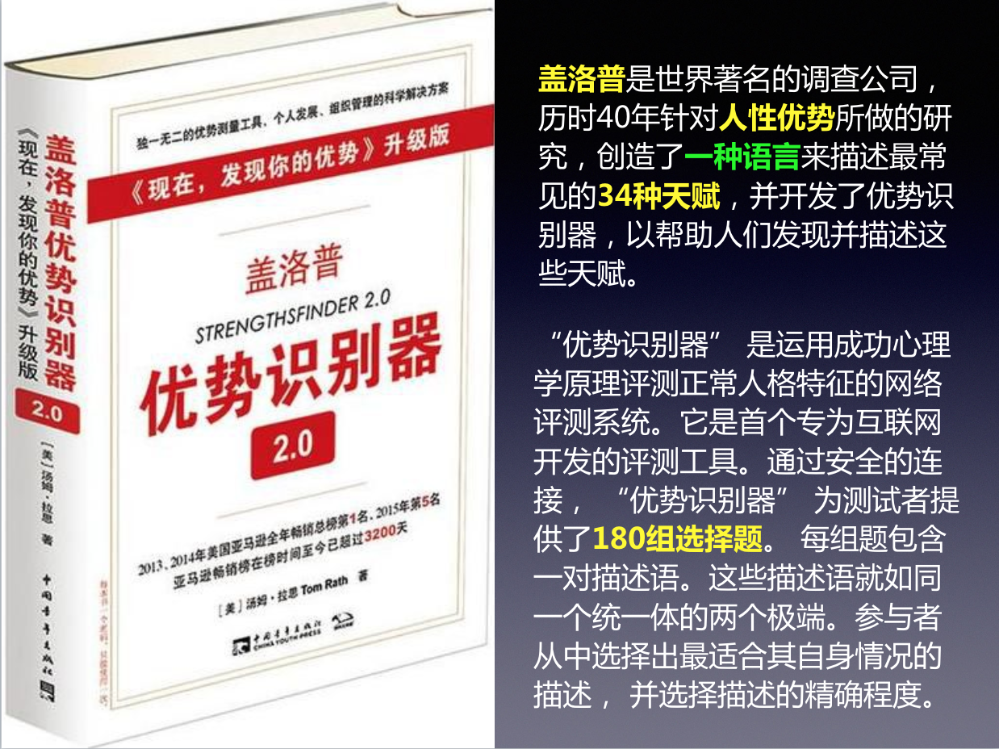
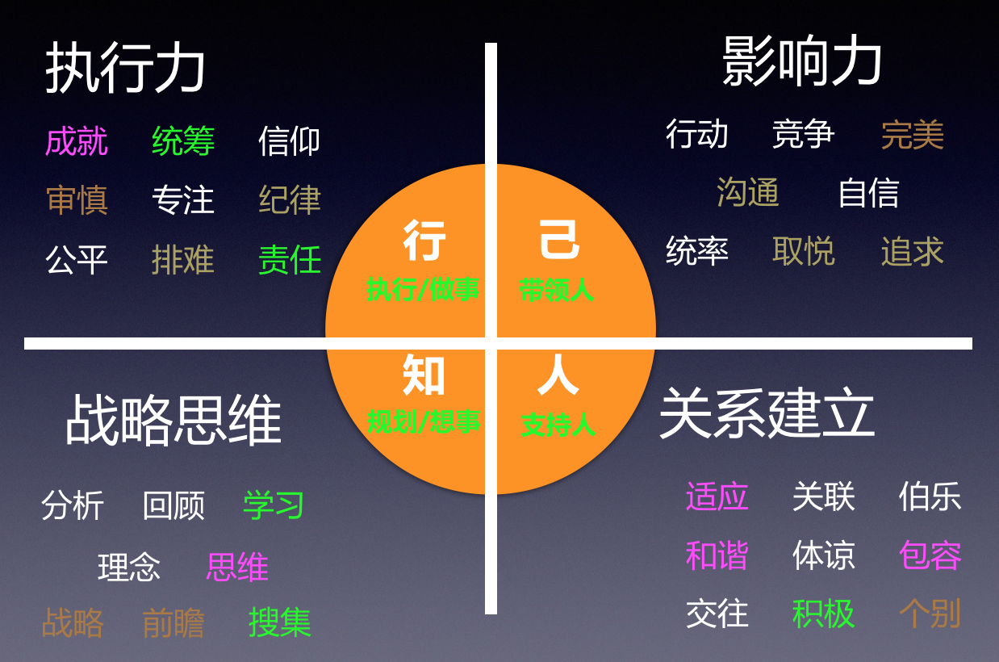

##### 天赋与优势|发现自己的天赋 - 盖洛普优势识别器

##### 34 种才干

**盖洛普优势识别器是描述天赋的一种语言，包含 34 种天赋才干主题**（文章尾有 34 个才干主题的简单阐述 , 有时英文单词更加容易明白）。从概率的角度来说，34 个才干主题，如果要顺序一样的话，那是超过 3 千万人中只有一个，基本上，我们做了测试后，咱们的结果都是唯一的。例如我自己的前五是：思维、成就、包容、和谐、适应。老实说，当我第一次拿到我的测试报告的时候，我自己也觉得疑惑，我有这样的才干？所以，从了解自己的角度，还是有必要让看得懂的老师来指导一下。

官方的盖洛普优势识别器是是要收费的，还不是很便宜，但是我认识的做过这个官方测评的都觉得值得，所以在能力范围内，可以做这个测试，至于有没有其他方法，大家可以百度一下。

**当我们做完前五测试后，就会有两份报告了， 一份是对前面五个优势的通用解释，另一份是操作指南，每个人都是不一样的。**

**需要注意**：
- 我们的前五只是我们在 34 个才干中排在前五，但是并不代表我们没有其他 34 个才干的其他 29 个。
- 我们的排在前面的是我们的核心才干，而我们的核心才干，不仅仅只是前五，有可能是前十或者前七八，所以我在上刘佳老师课程前做了前五的测试，上完课后就开通了自己的 34 个才干。

##### 四大优势领域
盖洛普公司基于长期研究，将 34 项天赋才干**划分四个维度：执行力、影响力、关系建立、战略思维**。

| 领域     | 解释                                                               |
| -------- | ------------------------------------------------------------------ |
| 执行力   | 指的是懂得如何完成某件事；                                         |
| 影响力   | 知道如何取得主导 / 表达意见 / 令人信服，并确保自己的声音被团队听到 |
| 关系建立 | 具备建构牢固关系的能力，从而将团队凝聚起来并发挥更大的力量；       |
| 战略思维 | 帮助团队思考可能发生的事，获取并分析信息，以做更好的决策。         |

四大优势领域对应的才干主题如下：

**我们结合自己从测试中得出的前五才干主题，分别在四大领域的位置，就知道我们自己核心才干在哪个领域**，而当我们知道我们的才干及其分布就可以开始管理我们的才干了。

譬如：我的思维、成就、包容、和谐、适应 (图中粉红的才干)，有 3 个在关系建立，1 个在执行力，一个在战略思维；当我看到自己的分布的时候，我发觉它们跟我的过去也是惊人的相似，我没有一个核心才干主题在影响力领域「取得主导 / 表达意见 / 令人信服，并确保自己的声音被团队听到」, 在我过去的几十年的生涯中，我都善于自己把自己份内事情做好，极少对外宣传，之前在简书写差不多 200 篇的文章，我所有的朋友都不知道；而我的「个别」才干是最后的，在团队中，我觉得我自己做得了的，别人也做得到。我也开始慢慢的去通过工具或者系统来管理我这样的核心和弱势才干。以前，我是一个前十有「学习」、「思维」的人，我其实学习很多，也想很多，也很享受学习与思维的过程，但是少对外说；现在，我开始写文，同时发推文，这样又可以让我的「学习」、「思维」有输出同时更加聚焦。

##### 总结
本文介绍了天赋与优势的一套语言「盖洛普优势识别器」及其 34 个主题才干和四大优势领域，市面上很多课程关于「职场」「效能」……，很多开篇就是要认识自己，而**盖洛普优势识别器也的确是其中一个很好的工具去认识我们自己，看到我们是一辆什么样的「车」，直到现在已经有超过二千万人做个正版的测试。**

未来会介绍更多用盖洛普优势理论和绽放我们的天赋。

###### 四大优势领域
- 成 就 Achiever
  - 成就主题较强的人大都精力充沛，锲而不舍。他们乐于忙忙碌碌并有所作为。
- 行 动 Activator
  - 行动主题较强的人能够将想法付诸行动。他们往往缺乏耐心。
- 适 应 Adaptablility
  - 适应性强的人倾向于 “随大流”。他们活在 “当前”，接受现实，随遇而安。
- 分 析 Analytical
  - 分析能力强的人喜欢探究事物的来龙去脉。他们有能力思考可能影响局面的诸多因素。 
- 统 筹 Arranger
  - 统筹力强的人兼具组织能力及确保组织成功的灵活性。他们善于合理安排现有资源以实现最大功效。
- 信 仰 Belief
  - 有强烈信仰的人必定拥有某种经久不变的核心价值观，并由此形成明确的生活目标。
- 统 率 Command
  - 统率力强的人有大将风度。他们运筹帷幄，指挥若定。
- 沟 通 Communication
  - 沟通能力强的人善于将想法付诸言辞，他们是极佳的交谈者和生动的讲解者。
- 竞 争 Competition
  - 竞争性强的人参照他人的表现来衡量自身的进步。他们力争第一，陶醉于竞争的喜悦中。
- 关 联 Connectedness
  - 关联主题较强的人深信世间万物都彼此关联。没有巧合，凡事必有成因。
- 公 平 Consistency
  - 公平心强的人深知应平等待人。他们确立并坚持这一准则，即公平地对待每一个人。
- 回 顾 Context
  - 回顾主题较强的人喜欢追溯从前。他们通过揣摩过去来了解当前。
- 审 慎 Deliberative
  - 他们每做一个决定均慎之又慎，并设想所有的困难。
- 伯 乐 Developer
  - 他们善于赏识并发掘他人的潜能。他们能够察觉任何细微的进步，并乐在其中。
- 纪 律 Discipline
  - 纪律性强的人做事井然有序，有章有法。他们建立规程，遵章守纪。
- 体 谅 Empathy
  - 他们能够设身处地地体会他人的情感。
- 专 注 Focus
  - 专注力强的人能够确定方向，贯彻始终，及时调整，矢志不渝。他们先确定重点，再着手行动。
- 前 瞻 Futuristic
  - 对于有较强前瞻力的人而言，未来令人心潮澎湃。他们用对未来的憧憬激励周围的人。
- 和 谐 Harmony
  - 和谐主题较强的人渴求协调一致。他们避免冲突，寻求共识。
- 理 念 Ideation
  - 他们痴迷于各种理念，能够从貌似毫无关联的现象中找出其相互联系。
- 包 容 Includer
  - 包容力强的人善于接纳人。他们关心那些被忽略的人们，并让他们溶入集体。
- 个 别 Individualization
  - 个别主题较强的人对每个人的与众不同之处兴趣盎然。他们善于琢磨如何将个性迥异的人组合在一起，创造出最大成效。
- 搜 集 Input
  - 搜集主题较强的人充满好奇。他们通常喜欢搜集、整理各种各样的信息。
- 思 维 Intellection
  - 思维能力较强的人的最大特点是长于思考。他们勤于自省，敏于探讨。
- 学 习 Learner
  - 学习能力强的人有旺盛的求知欲，渴望不断提高自我。尤其令他们激动的，是求知的过程而非结果。
- 完 美 Maximizer
  - 完美主题较强的人专注于激励个人和团体追求卓越。他们相信强中自有强中手。
- 积 极 Positivity
  - 积极的人浑身充满了富有感染力的热情。他们用快乐、向上来感召周围的人。
- 交 往 Relator
  - 交往能力强的人喜欢人际间的亲密关系。他们最大的满足是与朋友一道为实现一个目标而同舟共济。
- 责 任 Responsibility
  - 责任心强的人言必有信。他们信奉的价值观是诚实、忠诚。
- 排 难 Restorative
  - 排除故障的行家里手善于发现问题并解决问题。
- 自 信 Self-Assurance
  - 自信心强的人对自身的能力充满信心。他们有自己的处世准则，做决定时成竹在胸。
- 追 求 Significance
  - 追求主题较强的人希望在别人的眼中非同凡响。他们独立性强，渴望被承认。
- 战 略 Strategic
  - 战略主题较强的人足智多谋。针对不同的方案，能迅速找出相关的模式及结果。
- 取 悦 Woo「Winning Others Over」
  - 取悦主题较强的人喜欢结交新人并博取其欢心。能够在人际交往中打破坚冰、建立联系令他们倍感快慰。

#### 欢迎关注效能人生，了解更多效能工具。
![](https://github.com/chyonglong/efficientlife/blob/master/images/tailer.png?raw=true