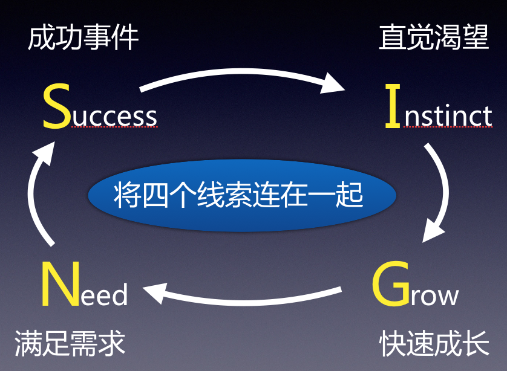
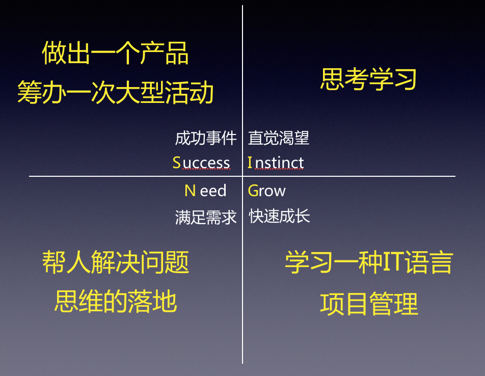

#### 天赋与优势|发现自己的天赋

上次分享，提到了基于优势的 2 个核心理念：1、每个人都拥有与众不同的天赋 / 才干；2、每个人最大的成长空间在于其最强的优势领。那怎么样发现自己的天赋呢？

1. 测试
2. 问人
3. 自察

##### 1. 测试

市面上有很多可以帮助咱们测试我们的优势，也有很多小伙伴已经接触过或者深入研究！譬如：

1. 盖洛普优势识别器
2. VIA 人格力量测评
3. MBTI 性格测试
4. DISC 行为风格测试
5. 霍兰德职业兴趣测试
6. 优势利用度测试
7. ……

对我而言，每种测试有点像不同的语言，它们都对优势做不同的诠释， 就能够让学习同一工具的小伙伴， 有统一的语言去描述天赋，而不至于鸡同鸭讲 ! 我们学习多一种语言，就可以从不同角度的去分析自己，有益无害！

我自己也暂时学习了盖洛普优势识别器和 MBTI 性格测试，刘佳老师的课程也是根据盖洛普优势识别器 , 譬如我的盖洛普优势识别器是测试结果前十是：
思维、成就、包容、和谐、适应
搜集、积极、责任、统筹、学习

未来也会写更多这方面的内容，一起学习同一语言，用它来描述天赋。

##### 2. 问人

找熟悉的朋友回答问题，并记录：

“在您眼中，请用 3 个词描述我最优秀的地方是什么， 为了帮助我更加的了解自己，请分别举个例子”

##### 3. 自察

- Success：成功事件
- Instinct：直觉渴望，自动自发
- Grow：快速成长，学的很快
- Need：满足需求，事后充满满足感

给出自己例子做参考：

我就会可以通过我的整理大概梳理出我自己的天赋：统筹、爱思考、爱学习、乐于助人、IT 语言学习……

##### 总结

得到的《超级个体》提到『车日路』模型，在我们选择我们的目标「日」和路径「路」之前，还是要看看我们的是什么车吧？如果我们是一辆跑车，却去走山路，不是浪费了自己吗？

那么，你是一辆什么车呢？

#### 欢迎关注效能人生，了解更多效能工具。
![](https://github.com/chyonglong/efficientlife/blob/master/images/tailer.png?raw=true