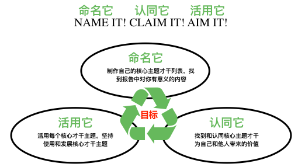

##### 天赋与优势|实践活用核心才干主题的三步法

天赋优势的公式是：优势 = 天赋 * 投入。

「天赋与优势|活用核心才干主题的三步法」就是很好的把天赋投入的三个步骤，这三个步骤也是要围绕一个目标从而形成优势！

补充一个自创的公式方便记忆：

投入 = 目标 * 三步法

那我们该怎么运用到实际中？

一个例子如下，我们可以参考写下属于自己的：

| 投入 = 目标 * 三步法                                                         | 例子                                                                                                                                                                                                                                                                    | 写出你的                            |
| ----------------------------------------------------------------- | ----------------------------------------------------------------------------------------------------------------------------------------------------------------------------------------------------------------------------------------------------------------------- | ----------------------------------- |
| 目标                                                              | 提高公众演讲                                                                                                                                                                                                                                                            | ……                                  |
| 命名它 name it：  写下自己的核心才干                           | 1. 审慎  2. 信仰  3. 责任  4. 纪律  5. 交往                                                                                                                                                                                                                      | 1. 2. 3. 4. 5.  |
| 认同它 claim it：  我的核心才干主题可能对我的目标有什么帮助？ | 1. 在我说话之前减轻压力和潜在问题  2. 仅分享我相信的主题  3. 准备并全心投入  4. 有序的组织自己的演讲，一步一步执行  5. 从心里与观众保持连接                                                                                                                      | 1. 2. 3. 4. 5.  |
| 活用它 aim it：  下一步怎么使用这个主题？                      | 1. 在我演讲之前，写下所有的潜在问题以及它们的解决方案  2. 让我的听众知道我愿意和不愿意谈论的主题  3. 准备演讲，练习演讲并在 Toastmasters 上的获得演讲反馈不断改进  4. 为我的演讲写下大纲，草稿和时间表  5. 与一位自己信任的、演讲出色的和乐于分享的朋友讨论第＃4 点 | 1. 2. 3. 4. 5.  |

始于天赋、终于优势。我想我们都想形成属于自己的优势，寻找我们的目标，活用核心才干主题的三步法 , 一起走在天赋优势的旅程中。

##### 参考链接

https://www.brentobannon.com/wp-content/uploads/2016/04/Name-It-Claim-It-Aim-It-Handout-by-Brent-OBannon.pdf