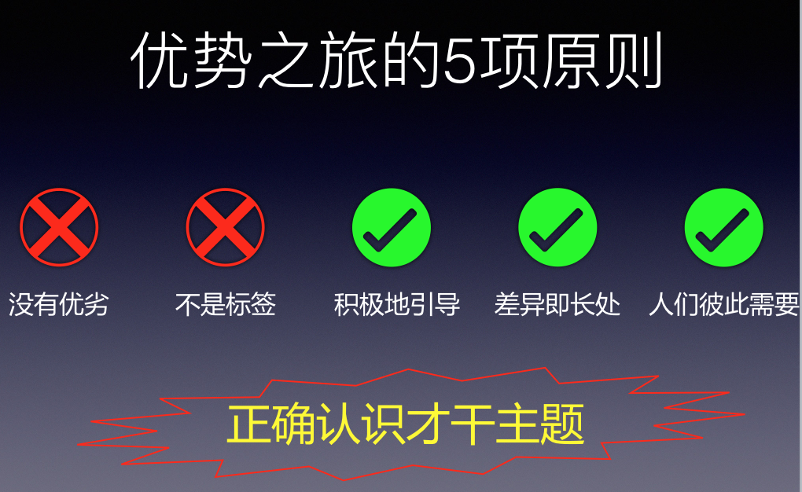

##### 天赋与优势|正确认识才干主题

当我们使用天赋优势时候，它会有三步：

1. 了解自己的天赋优势
2. 掌握发挥天赋优势的知识和技能
3. 利用天赋优势创造价值

直到现在，已经一起探讨了很多关于「了解自己的天赋优势」，包括：

- 1 个优势公式 - 优势 = 天赋 * 投入
- 1 套优势的语言 - 盖洛普优势识别器
- 2 个基于优势的 核心理念
- 3 种发现天赋的方法
- 34 个才干主题
- 4 个优势领域
- 4 个象限分析自我优势的优势反思图
- 3 个方面的弱势管理

「了解自己的天赋优势」是很重要的一步，没有种子就不会有结果; 如果不赞同这个理论或方法论的人，也不会尝试去用这套方法。

未来还会继续一起探讨「掌握发挥天赋优势的知识和技能」和「利用天赋优势创造价值」， 在「了解自己的天赋优势」方面，再补充**优势之旅的 5 项原则以正确认识才干主题**：

- 才干主题没有优劣之分
- 才干主题不是标签
- 积极地引导
- 差异即长处
- 人们彼此需要

###### 才干主题没有优劣之分
有时我们会以我们想成为那样的人来判断优劣。譬如自己想成为企业家，而觉得企业家需要战略思维，所以觉得战略思维下的「前瞻」「战略」优秀，但是想一想核心才干是不是没有「前瞻」「战略」是不是就不能成为企业家呢 ?

**当我们看到我们是一部跑车，我们可以选择正确的跑道，走到一样的终点。**我们知道我们的核心才干主题，就可以想想怎么样符合自己更好的方式去达到目标。才干主题没有优劣之分 !

###### 才干主题不是标签
说到标签，应该很多小伙伴都身同感受。你们 *0 后的人就是这样的，你们 *0 后的人就是那样的，我们的反应可能是你凭什么为我们乱贴标签。

同样的，才干主题不是标签，“你是「战略思维」突出的人，所以你的「执行力」差”,“你是「思维」突出的人，所以老是空想”， 我们「战略思维」突出，不代表我们「执行力」差;我们「思维」突出，不代表我们老是空想。

**不要以你是「 ** 」人来标签他人！**

###### 积极地引导
我想这里有两个方面：测试中自己不认同和自己认同的才干主题

- **自己不认同的才干主题**：首先就不要嫌弃它，而是去反思它在哪些方面带来正面的事情，积极地引导怎么样可以产生更多的正面的事情；同时也可以反思自己的不认同是不是过度使用了，想想如何避免。
- **自己认同的才干主题**：积极的引导它和投入，形成优势。

###### 差异即长处
盖洛普测试中前五相同的概率是超过 3000 万分之一，每个人的天赋都是不一样的，有差异的，而正是这些差异，同一个事情中不同的方面会产生长处。

###### 人们彼此需要
现在的社会分工是越来越细和明显了，无论是公司还是个人没有必要精通一切，人们彼此需要。 如果我们有一个足够的优势，知道我们自己的目标，利用系统化的思考，就可以用合作、购买的方式，补足你其他的短板。现在木桶定律不适用于个人甚至公司，我们要长板原理。

###### 总结

天赋不是神奇的能力，不是那些看起来高大上的东西。

**天赋是理所当然的认为，情不自禁的重复，轻易易举的成功。**

**天赋不是绝对稀有的能力**。同样有「学习」天赋的人一定不会少。

**但是天赋是相对稀缺的能力**。同样具备「思维、成就、包容、和谐、适应」在我身边估计就不多了，也就是在这样的组合下，其实**我什么都没有做在人群 20% 以上了**。

当然天赋的探索不仅仅限于盖洛普，同样适应于我们其他天赋探索或优势。譬如会编程的人一定不会少，但是又会编程，又会管理、英语、设计、表达的人，在人群中就不多了。

