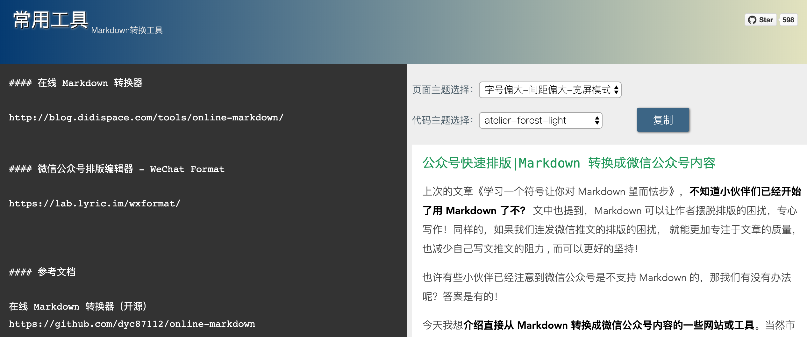
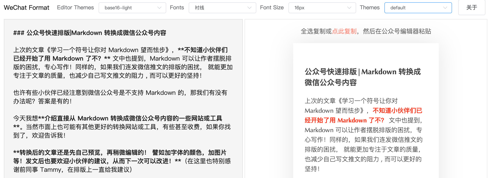
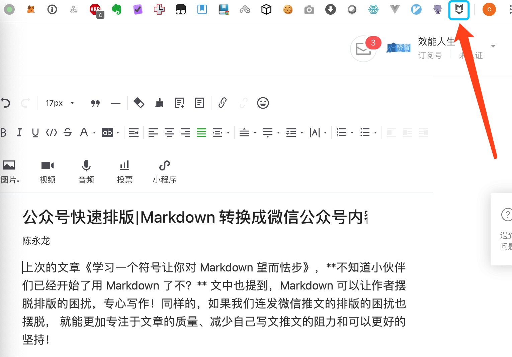
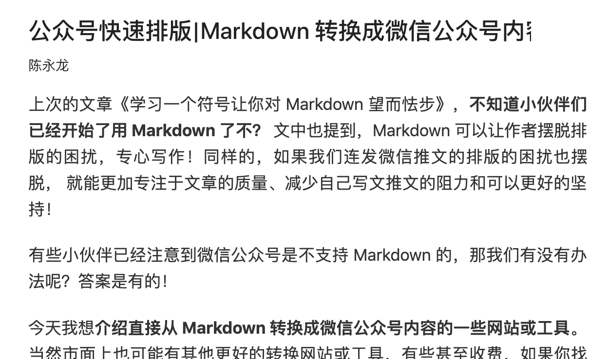

### 公众号快速排版|Markdown 转换成微信公众号内容

上次的文章《学习一个符号让你对 Markdown 望而怯步》，**不知道小伙伴们已经开始了用 Markdown 了不？** 文中也提到，Markdown 可以让作者摆脱排版的困扰，专心写作！同样的，如果我们连发微信推文的排版的困扰也摆脱， 就能更加专注于文章的质量、减少自己写文推文的阻力和可以更好的坚持！

有些小伙伴已经注意到微信公众号是不支持 Markdown 的，那我们有没有办法呢？答案是有的！

今天我想**介绍直接从 Markdown 转换成微信公众号内容的一些网站或工具**。当然市面上也可能有其他更好的转换网站或工具，有些甚至收费，如果你找到了，欢迎告诉我！我自己如果发现更好的，也会更换！

**转换后的文章还是先自己预览，再稍微编辑的！ 譬如加字体的颜色，加图片等！发文后也要欢迎小伙伴的建议，从而下一次可以改进！**（在这里也特别感谢前同事 Tammy，在排版上一直给我建议）

#### 1、在线 Markdown 转换器

这个网站是我一开始就找到的，也用它发了几个文章，它的标题是绿色，我自己觉得还好，所以想找一个更好的，就有了第二和第三种！

网站：
http://blog.didispace.com/tools/online-markdown/

效果：

#### 2、微信公众号排版编辑器 - WeChat Format

看上去好像是比第一种好看一点点， 当然我们的排版也是可以一次一次的从观察和反馈中变得更好的， 譬如我现在就发觉1、2级标题字体会有点大，现在基本用3、4、5。

网站：
https://lab.lyric.im/wxformat/

效果：

#### 3、Chorme 插件 markdown-here

需要下载插件，可以自己定制化转换，懂得定制的小伙伴会喜欢这个！

下载地址
https://markdown-here.com/index.html

效果：
把 Markdown 内容复制到公众号，点击 Chorme 插件 markdown-here 就自动转换了，而且它还支持邮件的内容 Markdown 转换！

##### 点击前

##### 点击后

#### 参考文档

在线 Markdown 转换器（开源）
https://github.com/dyc87112/online-markdown

微信公众号排版编辑器（开源）
https://github.com/lyricat/wechat-format

#### 欢迎关注效能人生，了解更多效能工具。
![](https://github.com/chyonglong/efficientlife/blob/master/images/tailer.png?raw=true