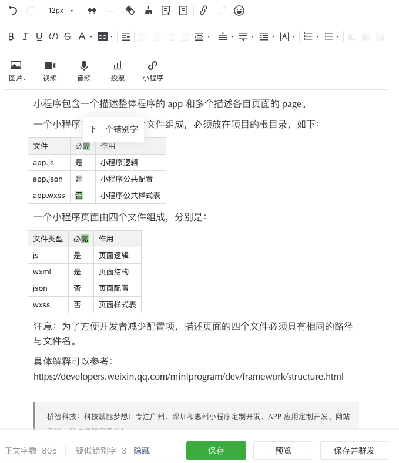

# 介绍 2 个网站提高文章专业度

## 1、为什么我就是能这样娴熟地加上空格呢？
https://zizhengwu.github.io/daft-auto-spacing/

#### 2、微信公众号排版编辑器 - WeChat Format

看上去好像是比第一种好看一点点， 当然我们的排版也是可以一次一次的从观察和反馈中变得更好的， 譬如我现在就发觉1、2级标题字体会有点大，现在基本用3、4、5。

网站：
https://lab.lyric.im/wxformat/

效果：

#### 3、在微信公众号里面发文，然后通过“疑似错别字”修改错别字。

#### 4、预览与发文