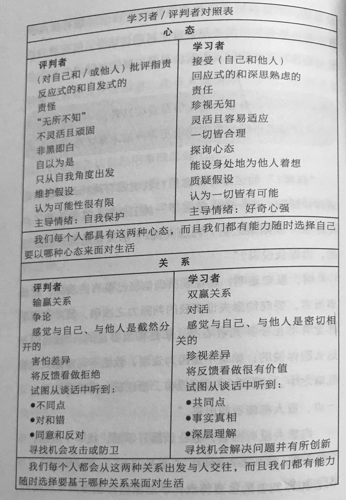
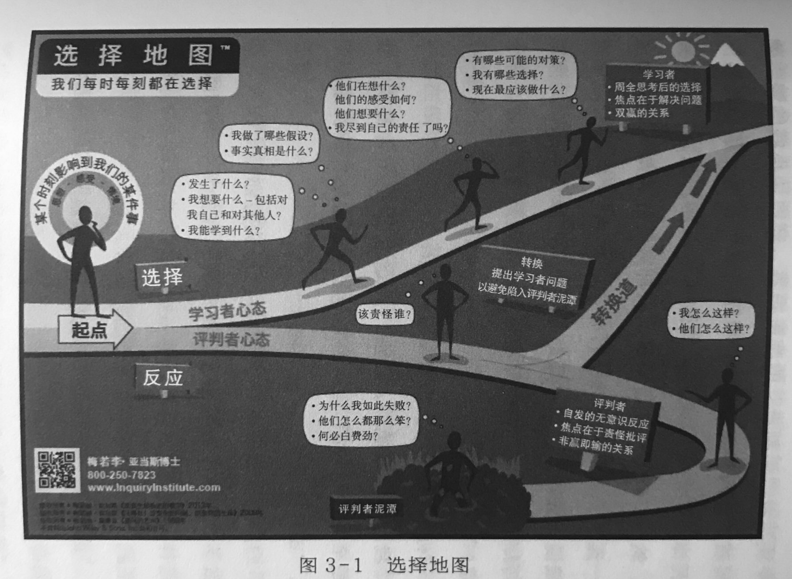

#### 读书|我是一个学习者还是一个评判者 ?

读《改变提问，改变人生》

每一件事，都在问问题，问题是这些问题是自己无意识的反应还是周全思考后的选择！

也带出来了两种人：学习者与评判者

评判者在问评判者的问题，最后的结果可能是泥潭；学习者在问学习者的问题，最后的结果可能是自由。

同一个世界，不同人有不同的看法，也就是不同的世界观， 以为看到了这个世界，其实只是世界观而已 .

用世界观去看世界，所以觉得一切不顺意的都是它错，该责怪谁，它们怎么不去这样做；也或许自己的否定而判断对他人的否定，自己不愿意做，所以别人也不会愿意做。

书中提出学习者与评判者不同的主导情绪: **评判者 , 自我保护; 学习者 , 好奇心强。**

评判者在问自我保护的问题，假设的问题；学习者在问好奇心强的问题，去探索更多的可能性。

书中提供了一个 “**选择地图**”， 遇事的正常反应是评判者，已经知道了答案， 无需去探究；但是可以选择，通往学习者心态 . 好奇心是通往学习者心态的捷径 .

那怎么样通往学习者心态？

接受评判者，修炼学习者。3 步：

- 1、接受评判者
- 2、从评判者心态走入选择心态
- 3、进入学习者

##### 1、接受
接受评判者的心态，是不是给自己或他人假设? 接受了才能觉察！

##### 2、从评判者心态走入选择心态

**ABCC 选择法** 
- A（aware）觉察 我现在是处于评判者状态吗？ 
- B（breathe）深呼吸 我是不是需要停下来，退后一步，更客观地来看这件事？ 
- C（curiosity）好奇 我是否了解所有的事实？到底发生了什么？ 这是我要的感受吗？这是我想做的吗？
- C（choose）选择 我更希望自己怎样做？我的选择是什么？ 

##### 3、进入学习者

**学习者提问**：
- 1、我想要什么？ 
- 2、我有哪些选择？ 
- 3、我都做了哪些假设？ 
- 4、我该承担什么责任？ 
- 5、这件事我还可以从什么角度来看？ 
- 6、对方在想什么，感受如何，他想要什么？ 
- 7、我错失了什么，或者我在逃避什么？ 
- 8、从这个人身上或这件事本身，我能学到什么？ 
   从这个错误或失败中，我能学到什么？ 
   从这次成功中，我能学到什么？ 
- 9、当前最有意义的行为步骤是什么？ 
- 10、我应该向自己或他人提出哪些问题？ 
- 11、我怎么才能把这件事变成双赢的局面？ 
- 12、有什么样的可能性？ 

第一步到第 3 步，提问改变了，所以《改变提问，改变人生》

> 书中列神学家约瑟夫·坎贝尔所说的一句话：**你被羁绊和失足之地，即是无尽宝藏之所。**
> 
> 更有意思的是：在被羁绊和失足之时，宝藏是不是还可以被挖掘出来？ 还是不断的重复一样的失足？ 
> 
> 学习者心态或许是关键！
> 
> 书中一金句：**改变，从希望发生改变的那个人开始。**

