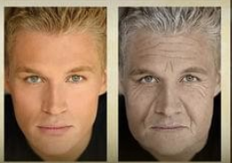

# 推荐一个 APP 看到未来老去的自己减少拖延

乔布斯在斯坦福大学说：
> 我每天早晨都会对着镜子问自己:“如果今天是我生命中的最后一天 , 你会不会完成你今天将要做的事情呢 ?” 当连续很多天答案都是 “否” 的时候 , 我就知道自己需要改变一些事情了。

乔布斯的成功原因之一，是他可以看到在未来生命中的最后一天，影响他每次的做出伟大的产品。

普林斯顿大学心理学家艾米丽·普罗宁通过实验证明，** 大脑错误的想象会让我们像对待陌生人一样对待未来的自己 **。原因在于，我们无法看清未来是什么样子，也无法像感受目前、当下一样，能这么清晰地知道未来自己的想法和感受。这是进化到目前为止的大脑的局限。而且更为糟糕的是，大脑还会自欺欺人地把未来的那个自己理想化，大脑告诉我们，未来的那个自己有更多的时间做现在的自己不愿望做的事、意志力更强能抵制得住诱惑、生活方式更健康、更能忍住得住痛苦……。

所以很多小伙伴不能够想乔布斯看到未来的自己，而是把未来的自己看作是陌生人，所以把现在的事情无情的抛给那个陌生人-未来的自己：从明天开始跑步；以后才开始写文；到期日才匆忙完成任务……也就是不断拖延！

推荐一个 APP 看到未来老去的自己。它就是 AgingBooth。ios/android app 商城下载就可以了。

下载后，操作很简单！打开软件，拍张照片，点下眼睛、嘴巴、下巴，按『READY?GO!』就可以了。

生成的图片会类似这个样子！

第一次看到自己帅帅的样子突然变老的时候，有点点不太习惯（对有美颜小伙伴要求慎用）！可是当我看到自己这样老去的样子的时候，就开始反思：

- 我需要做一下不一样的东西吗？让自己无悔！
- 我需要留点钱给自己吗？让自己快活！
- 我需要锻炼身体吗？让自己不那么老！

久不久打开来看！甚至把它记在脑里！它在一定程度上帮助了我自己的拖延！

有勇气的你可以试试！

---
#### 欢迎想一起探讨或有更好解决方案的小伙伴加我好友（备注 “效能”）

#### 欢迎关注效能人生，了解更多效能工具。
