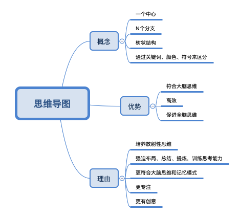
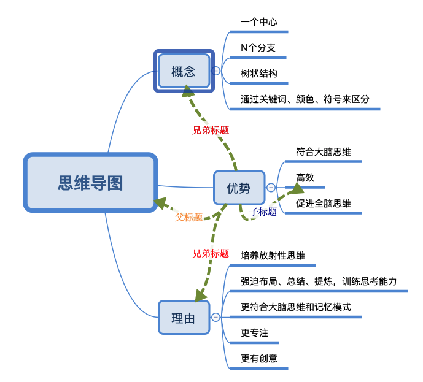
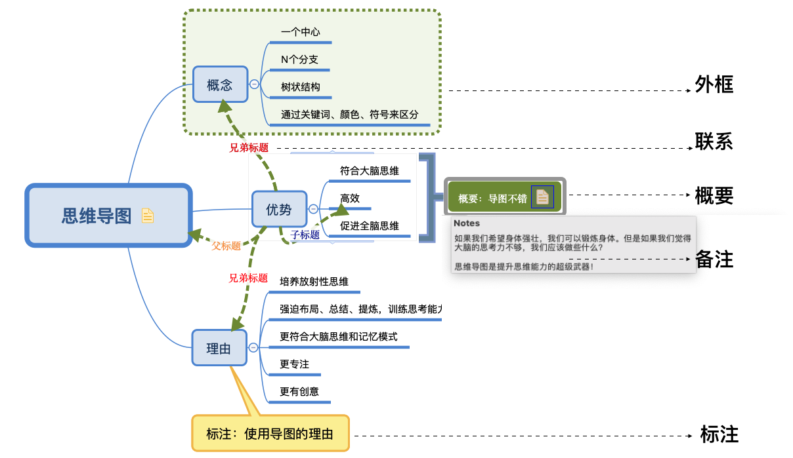
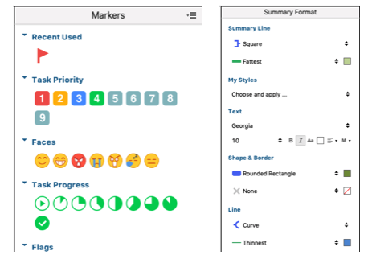

#### 提升思维能力的超级武器|思维导图 

昨天发文，介绍了通过脑图的方式找到自己多维角色的时候，有意思的是， 有小伙伴还顺带推广了思维导图的课程， 也有很多小伙伴，很想学思维导图。作为一个计算机工程师（码农）， 我也接触思维导图很久了， 也会用它来做分析需求，做笔记，定角色等，也来介绍一些基于xmind的脑图和一些用法（其他脑图工具也是大同小异）。

关于思维导图， 我喜欢《思维导图攻略》书中的一个描述：

如果我们希望身体强壮，我们可以锻炼身体。但是如果我们觉得大脑的思考力不够，我们应该做些什么？

思维导图是提升思维能力的超级武器！

思维导图用多了， 思维能力也提升了！那它是什么？ 为什么要用？ 用它的优势是什么？最近刚好看到一个脑图很好的看懂。同时，思维导图并不是永远都是八爪鱼似的， 思维导图的图可以是多种形式的（譬如：鱼骨图），那些可以帮助导向咱们提升思维的图，都可以是思维导图，八爪鱼的脑图是思维导图一种。

至于是用手写还是软件就见仁见智了， 哪个觉得对自己更有帮助就用哪个好了！对一个习惯用计算机的我还是喜欢用软件！

下面介绍xmind（其他脑图工具也是大同小异）
1. 基本操作和快捷键使用

首先说一个简单的概念：所有标题，除了中心标题、最后一个分支标题或单一分支，都会有其父标题、子标题和兄弟标题。

知道了父标题、子标题和兄弟标题后， 操作就比较简单了，这里也不一一操作， 但是特别想提的是， 对追求效率的你， 一定要用快捷键。

| 菜单       | 操作         | 快捷键        |
| ---------- | ------------ | ------------- |
| 插入标题   | 插入兄弟标题 | enter         |
| 插入父标题 | 插入父标题   | tab           |
| 插入子标题 | 插入子标题   | cmd/win+enter |

2. 补充和修饰功能

这里也主要给一个抛砖引玉作用，小伙伴可以知道有类似的功能， 然后按所需可以使用。
- 外框：强调
- 联系：两标题关系
- 概要：阐述
- 备注：加长解释
- 标注：强调

在xmind里面还有对不同的标题加小图案或者修改样式的功能， 小伙伴们自己玩下！我自己还是很喜欢在标题加旗子或者1、2、3、4等，起到对标题强调的作用。

3. 思维模式和模板

类似通过脑图的方式找到自己多维角色, 我们将不同的思维模式放到导图作为模板，从而让我们可以利用导图从更多的、更全面的和更宏观的角度去分析自己所面对的问题，实现更高效的人生！

以后， 主要也是介绍不同的思维导图的模板，从而提升我们的思维模式！

思维导图软件本身， 只要用了几次就可以很快的上手了。思维导图本身最有意义的是可以提高我们的思维能力。通过发散思维，通过不同模板的思维模式，通过运用思维模式的步骤一步一步让我们有更强的大脑。

上年参加高志鹏，高哥《全脑思维创新与问题解决》培训中提到一个点很好，我们需要提高我们的ASK「 Attitude(态度) Skill（能力） Knowledge（知识）」 ，然而知识技能和态度都是建立在T-Thinking（思维）的基础之上，所以有了全面的思维，丰富的知识和技能，良好的态度就可以帮助我们更好的完成每一项任务 TASK！如果底层的思维Thinking错了，上面再有ASK，还是无法完成TASK。！

思维导图就是这样的工具可以提升我们的思维！
