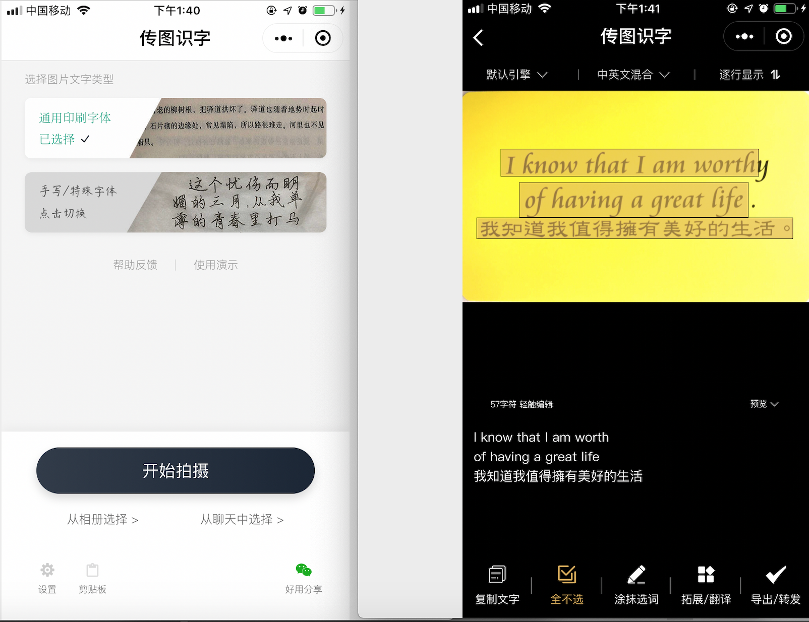
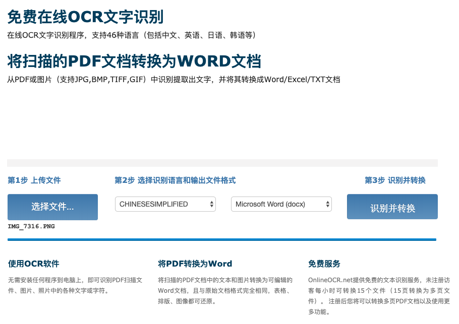
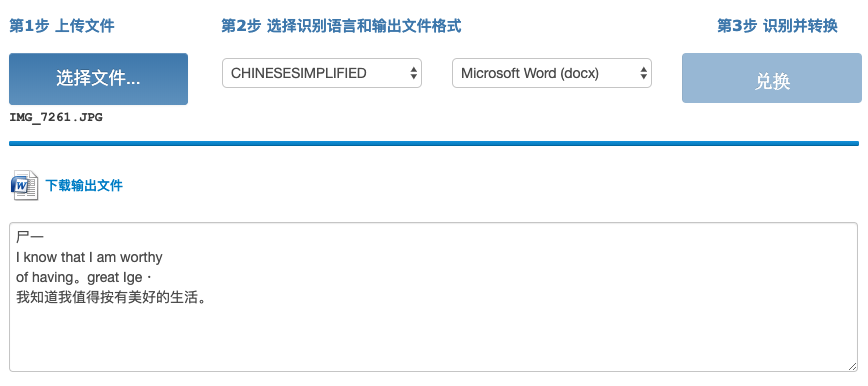
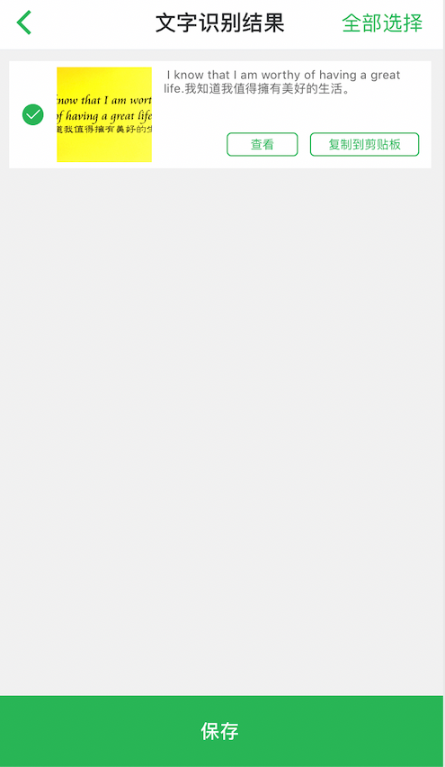
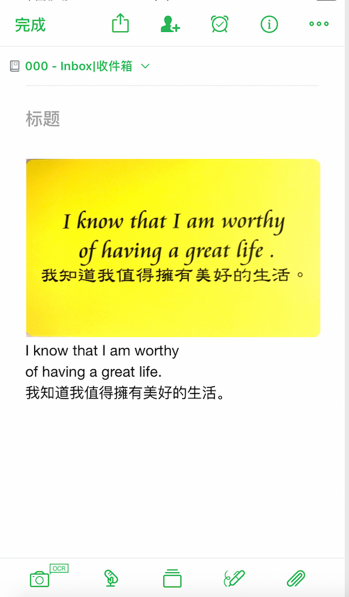

# 提高做笔记速度|OCR图片文字转文本

有时候咱们有这样的需求，需要复制图片里的内容但是又懒得去打所有的文字，所以就会想有没有这样的工具可以帮助我们，直接把图片里文字转成为文本呢 ?

在这里介绍三个 OCR 工具把图片文字转文本，当然转换出来的文字还是有机会稍微修改，不过我觉得还好！

三个 OCR 工具把图片文字转文本​

•1、小程序 - 传图识字

•2、网站 - 免费在线 OCR 文字识别

•3、印象笔记 OCR 上传

##### 1、小程序 - 传图识字

微信搜索小程序『传图识字』

操作很简单，传图就可以了，这个小程序还可以转换手写的图片。（当然不要写得太潦草了）

##### 2、网站 - 免费在线OCR文字识别

网站：
https://www.onlineocr.net/zh_hans/

步骤也在网站有提示了：
第1步 上传文件
第2步 选择识别语言和输出文件格式	
第3步 识别并转换

结果如下

##### 3、印象笔记OCR上传

印象笔记或其他一样功能的笔记肯定是所有提高效能的工具之一，今天就只是提到这个OCR功能。

上传图时候，把『提取文字』勾了，然后就可以识别文字并直接保存在笔记中了。对喜欢用印象笔记的做笔记的小伙伴，效率顿然升级很多！

步骤如下：

#### 欢迎关注效能人生，了解更多效能工具。
![](https://github.com/chyonglong/efficientlife/blob/master/images/tailer.png?raw=true