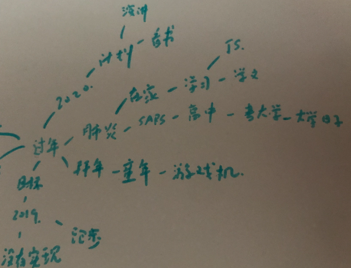

#### 演讲|素材源源不断

有时有些小伙伴会说不知道在演讲中说些什么？

事实上，每个人都有自己的人生，自己的经历，自己的所学，每个人都资源具足，只是想不出来该分享什么，我想给出一些 “药引子”，把这些素材带出来，让自己的素材源源不断！**我们每一个人，其实都有一个素材库。**

黄执中说：上台会紧张，是表层问题；而如何让自己对一件事产生表达的欲望，这才是深层问题。很多减低紧张的方法只是在缓解生理上的紧张，而不是在解决心理上的紧张。表达的欲望可以解决心理上的紧张 ! **我们要怎样才能找到表达的欲望呢？解决的方法，就是要学习怎么去挖掘素材。**

当然，演讲台上的表现，素材只是其中之一，还有主题、演讲结构、肢体语言、语气语调 …… 但是**当你有了这种素材之后，你就不会脑袋一片空白，你就有了分享的动力，你就可以吸引听众，你就可以引发好奇，你就可以真正解决那些表达的问题。**

接下来带来 3 个部分 “药引子”：

- 1、关于转变的素材
- 2、技巧与经验
- 3、没有办法的方法

##### 1、关于转变的素材

只要有转变，那肯定有转变前、转变后已经转变的原因，所以转变，就会有说不完的故事在背后了。

我会把转变分为三类
- 状态的转变
- 态度的转变
- 认知的转变

###### 状态的转变 " 药引子 "

状态的转变是指从 A 到 B，以前是这个样子，譬如我以前是个胖子，现在我是一个帅哥；我以前是个害怕上台的人，现在我热爱讲台！……

**状态转变的 " 药引子 " 是： 我曾经……**

写出你的 " **我曾经……**", 你会发觉有很多值得去分享。

譬如：
我曾经是胖子
我曾经是宅男
我曾经是哼哈之王
……

###### 态度的转变 " 药引子 "

态度的转变是指深信 A，但是遇到某事，原来非 A。譬如我宵夜店是到处都有的，但是我出差北京时候，北京很少宵夜店。

**状态转变的 " 药引子 " 是： ……让我难以置信的事情**

写出你的 "**……让我难以置信的事情** ", 你会发觉有很多值得去分享。很有意思的是态度的转变是转变的那一刻有感觉，但是转变了就习以为常，所以这个最好常写。

譬如：
银行之间也需要互相兑换零钱 让我难以置信的事情
北京很少宵夜店 让我难以置信的事情

###### 认知的转变

认知的转变是知道了新的东西。这个可以说，只要我们在学习：书、音视频、课程、pathways、工作坊……我们就不会没有素材！

**状态转变的 " 药引子 " 是： 我学到了…… 和 我正在学 ……**

" **我学到了……**", 如果你要藏着捏着那就没有办法，如果你要学习更多的知识，那就分享吧！
譬如：我学到了…… 
怎么样让我的素材源源不断
天赋与优势
……

" **我正在学……**", 这个是绝招，之前的 “药引子” 是把过去的东西揪出来，但是这个是正在进行时，我们常说教就是最好的学，把正在学的都分享出来吧！
譬如：我正在学……
如何讲故事
积极心理学
……

##### 2、技巧与经验

技巧与经验，你懂得，你做过的他人未必做过，而即使做过，你又有自己的独特秘籍或看法，这些都是观众所想听的

**技巧与经验的 " 药引子 " 是： 我懂得…… 和 我去过……**

" **我懂得……**", 在你的工作领域或生活领域，你懂得肯定很多，都是值得分享的 
譬如：我懂得………… 
项目管理
演讲
编程
……

" **我去过……**", 去过的地方也是很好的素材，为什么特别？花费？准备？……， 当然自己的家乡也是可以分享的，当然还是要站在听众角度出发。
譬如：我去过……
北海道
青岛
甘肃
云南
……

##### 3、没有办法的方法

**没有办法的那有没有其他方法呢？ 答案是有的，原点引爆。**

**原点引爆**: 以一个关键词为原点，从这个词出发，联想到更多的关键词。

如果认真写的话，可以把自己东一点西一点的经历，整理出来，从而找出自己的素材！

原点引爆技巧 , 这是摩西老师的提法 , 百度一下也有很多资料，而这招也是从世界亚军 Kwong 的工作坊学的， Kwong 提到的 "SPLAT" 的方法找演讲的故事。 SPLAT 是一个关键词做开始点，一条线的联想出更多的关键词。

譬如，我以 “过年” 开始，写了一点。其中我觉得跑步，计划，甚至童年都是可以分享的点。

" 药引子 " 把我们的素材都揪出来了，同时，源源不断的素材，不单单来自过去或者正在学的，而我们可以去创造属于我们自己的素材： 制定我们的目标，实现未来的目标；保持好奇心，去探索更多的未知；从不同的渠道学习更多的知识。